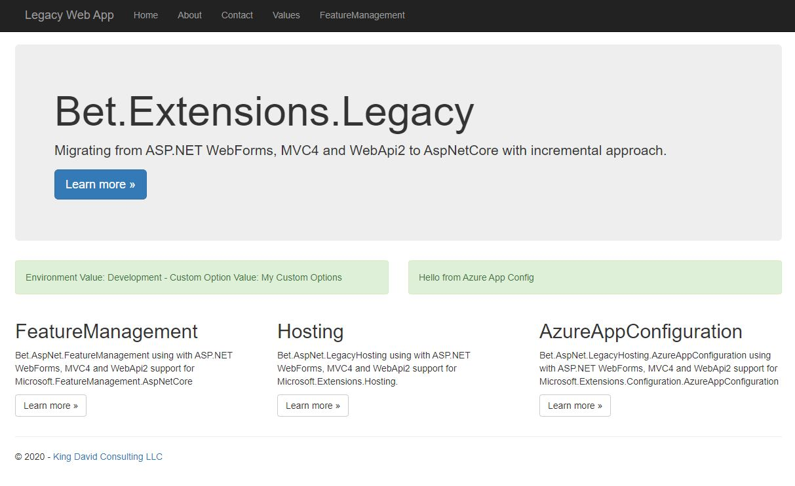

# Bet.Extensions.LegacyHosting

[](https://raw.githubusercontent.com/kdcllc/Bet.Extensions.Legacy/master/LICENSE)
[](https://ci.appveyor.com/project/kdcllc/bet-extensions-legacy)
[](https://www.nuget.org/packages?q=Bet.Extensions.LegacyHosting)

[](https://f.feedz.io/kdcllc/kdcllc/packages/Bet.Extensions.LegacyHosting/latest/download)

The goal of this project is to provide a gradual migration path for legacy Asp.Net WebForms, MVC4, WebApi2  with support of `DotNetCore` and `AspNetCore`.

The collection of libraries in this repo enables usage of the following Microsoft nuget package with Legacy projects:

**NOTE: no need to have `DotNetCore` installed on Windows IIS Web Server to utilize libraries in this project. The libraries are testing in production apps currently residing on Azure Cloud**

- For [`Microsoft.Extensions.DependencyInjection`](https://github.com/dotnet/extensions) use [`Bet.AspNet.DependencyInjection.Legacy`](./src/Bet.AspNet.DependencyInjection.Legacy/)
- For [`Microsoft.Extensions.Options`](https://github.com/dotnet/extensions) use [`Bet.Extensions.Options.Legacy`](./src/Bet.Extensions.Options.Legacy/)
- For [`Microsoft.Extensions.Hosting`](https://github.com/dotnet/extensions) use [`Bet.AspNet.LegacyHosting`](./src/Bet.AspNet.LegacyHosting/) and  [`Bet.AspNet.LegacyHosting`](./src/Bet.AspNet.LegacyHosting/)
- For [`Microsoft.Extensions.Configuration.AzureAppConfiguration`](https://github.com/Azure/AppConfiguration-DotnetProvider) use
- For [`Microsoft.FeatureManagement.AspNetCore`](https://github.com/microsoft/FeatureManagement-Dotnet) use Be[`Bet.AspNet.FeatureManagement`](./src/Bet.AspNet.FeatureManagement/)

## Audience

- Developers who are stuck with supporting `ASP.NET WebForms` or .NET `4.7` applications but still want to learn and grow in your career.
- Developers who are trying to migrate `ASP.NET` or `.NET 4.7` Applications to AspNetCore but don't have ability to migrate the entire application at once.
- ASP.NET Web Apps that need to load configurations without restart.

## Solution Projects

- [`Bet.AspNet.DependencyInjection.Legacy`](./src/Bet.AspNet.DependencyInjection.Legacy/) - Legacy Support for `Microsoft.Extensions.DependecyInjection`.
- [`Bet.Extensions.Options.Legacy`](./src/Bet.Extensions.Options.Legacy/) - Adding support for `Web.config` or `App.config`.
- [`Bet.Extensions.LegacyHosting`](./src/Bet.AspNet.LegacyHosting/) -Adding `Microsoft.Extensions.Hosting` to Console Applications.
- [`Bet.AspNet.LegacyHosting`](./src/Bet.AspNet.LegacyHosting/) - Adding `Microsoft.Extensions.Hosting` to existing Asp.Net Web Applications.
- [`Bet.AspNet.FeatureManagement`](./src/Bet.AspNet.FeatureManagement/) - Adding `Microsoft.FeatureManagement.AspNetCore.` to existing Asp.Net Web Applications.
- [`Bet.AspNet.LegacyHosting.AzureAppConfiguration`](./src/Bet.AspNet.LegacyHosting.AzureAppConfiguration/) - Adding `Microsoft.Extensions.Configuration.AzureAppConfiguration` to existing Asp.Net Web Applications.

## Sample Asp.Net WebForms/MVC5/WebApi2 application



- [`Bet.WebAppSample`](./Bet.WebAppSample/) - Utilized all of the libraries example.

## Manual

```bash
    dotnet build Bet.Extensions.Legacy.Nuget.sln -c Release
    dotnet pack Bet.Extensions.Legacy.Nuget.sln -c Release -o pack
```


## References

- [Feature Management Workshop](https://github.com/kdcllc/FeatureManagementWorkshop)